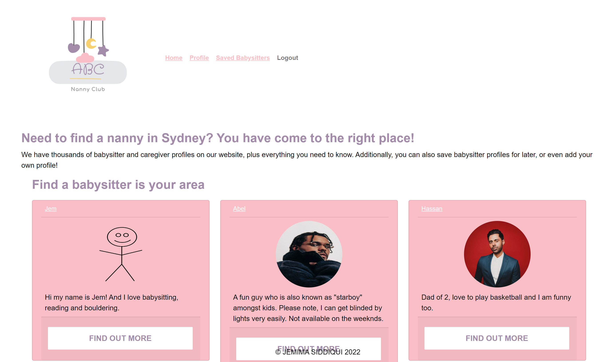

# ABC-Nanny-Club-by-Jemima-Siddiqui
## Description
This project is a MERN stack application that works with real-world data to solve a real-world challenge, with a focus on data and user demand. ABC Nanny Club is a website that helps you connect with nearby babysitters, save their profile for reference and provide reviews. It also allows individuals interested in babysitting to register themselves in the system and be recognised by their community.

## Table of Contents
* [Installation](#installation)
* [Usage](#usage)
* [Technology](#technology)
* [License](#license)
* [Questions](#questions)

## Installation

### Downloading Visual Studio Code 

 Download the latest version of Visual Studio to your local machine (Mac, Linux or Windows). Please use the following link to download the latest version of VS Code [Download VS Code](https://code.visualstudio.com/download). 

### Pulling the repository from Git 

If you would like to acess the source code, please navigate to the following public Github repository [Github Repository](https://github.com/JemimaSiddiqui/Good-README-Generator-by-Jemima-Siddiqui.git). 

* Clone the repository to your local desktop using the following steps:

  * 🔑 Use the terminal command `cd` to navigate to the directory where we want the repository located. In this case, we will save it to the Desktop. 

  ```bash
  cd Desktop
  ```

  * 🔑 Use the git command `git clone` followed by the URL copied from Github to clone the repo to our local machine.

  ```bash
  git clone <url>
  ```

  * 🔑 Use the `git clone` command creates a new directory with the same name as the repository. We navigate into our new directory using `cd`.

  ```bash
  cd ABC-Nanny-Club-by-Jemima-Siddiqui
  ```
* After the repository has been cloned to your local machine, open the files using Visual Studio application. 

## Usage
Click [here](https://young-escarpment-62681.herokuapp.com/home) to see the deployed application. 



* Step 1: Change into the directory of the application 
* Step 2: Run by using the following command in the command terminal in VS Code to install all the dependencies. 

```bash
  npm install
```
* Step 3: You can then run the application locally by using the following command. 

```bash
  npm run start:dev 
```

* Step 4: To see seeded data, you need to run the following command. 

```bash
  cd client && npm run seed 
```

## Technology 
Here is a list of technologies utilised for the development of this project: 
* React for front end, and GraphQL paired with Node.js and Express.js for backend 
* MongoDB to save an extensive amount of data such as babysitter profiles 
* Queries and mutations for retrieving, adding, updating and deleting data 
* JSON Web Tokens (JWT) for user authentication 
* ARV for form validation for user profile creation

## License
This application is covered under the MIT license.

    
## Questions
Author: [JemimaSiddiqui](https://github.com/JemimaSiddiqui)

If you have any further questions, please feel free to contact me at: [jemimasiddiqui12@gmail.com](mailto:jemimasiddiqui12@gmail.com)
